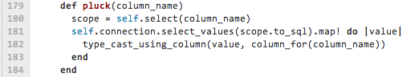
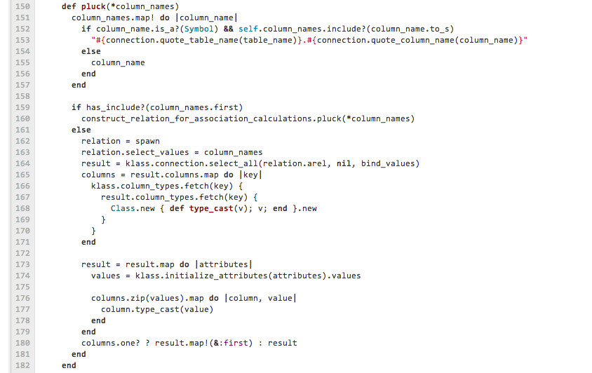

!SLIDE 

# Why is it better to be *coder* than **architect**?

!SLIDE 

## Why is it better to be coder than architect?
# *For Me*

!SLIDE 

# There was also a marketing name 
## that I didn't manage to copypaste it

!SLIDE 

# Who is an architect?

    me: "Человек, который умеет писать код,
      может решить эту задачу за 10 минут"

    someone: "Я не пишу код.
                Я больше по архитектуре."

!SLIDE 

### Architect Facts:

* Handles most modern smart phone in a hand
  * Not less than 1 hour a day
* Thinking about  "Architecture"
  * Not less than 6 hours a day
* Has 3 or more databases in project
  * Better when project is not yet released
* Go to meetings 
  * Not less than 1 hour a day

!SLIDE 

## Some *common* 
# Programming **Mistakes**

!SLIDE 

## High load

Most people think that  
when web site becomes popular  
a **high load issue** becomes a bottle neck.

This is **not true** for most of the projects:  
reach load problems is harder  
than reach *support problems*  

!SLIDE 

# Example of Support Problem

The initial version of ActiveRecord::Relation#pluck looked like this 

How do you think how big is it now?

!SLIDE 

!SLIDE 

## The Art of Decision Making 

# What is a *benefit* of using *Resque* over **DelayedJob**?

## It uses *Redis* as backend instead of **MySQL**

!SLIDE 

    
    Delayed::Job.enqueue(...)

    Delayed::Job Create (0.2ms)   
        INSERT INTO `delayed_jobs` (...) 
                            VALUES (...)

!SLIDE 

    Resque.enqueue(...)

    Redis >> SADD resque:queues low
    Redis >> 4.09ms
    Redis >> RPUSH resque:queue:low {...}
    Redis >> 0.28ms

### And BTW how to enable logging in Resque?

!SLIDE 

## Delayed Job:

    Delayed::Job.all

## Resque:

    ???

## You have to learn a new commands 
## to do same thing

## over and over again

!SLIDE 

## Another example of 
# Picking wrong library

    Removing *** gem
    ---
     Gemfile              |  1 -
     Gemfile.lock         |  3 ---
     app/models/coupon.rb | 10 ++++++++--
     .../show.haml        |  2 +-
     lib/util.rb          |  4 ++--

    11 insertions(+), 9 deletions(-)

!SLIDE 

Random phrase from the internet:

## "Hey! I already know a framework 
## that uses same ideas as Node.js
  
!SLIDE 

# It is Visual Basic."

IT is following the loop just like any other industry
And it's Ok!

!SLIDE 

# *Root* of the **problem** 

!SLIDE 

# People pure vision 
# of the architecture is based on
# their **implicit faith** 
# that they can *see the future*

!SLIDE 

## Sometimes you will try to write code 
## that *fit the future* of your application

# While it **doesn't fit presence** 
# of your application yet

!SLIDE 

## What is an **architecture**?

# It is a code *reuse metrics*

!SLIDE 

# Why define it like this?

* Good products tend to make one thing in 10 different ways 
  * over do 10 different things
* Less lines of code is one of the greatest quality metrics

!SLIDE 

## Github Commits CRUD

* manage with git command line
* manage though web
* receive as web hooks
* receive as email
* etc.

!SLIDE 

# What *code to reuse*?

!SLIDE 

# You will know it 
## as soon as you *start writing* 
# reusable code *yourself*

!SLIDE 

# Advices

!SLIDE 

## We should understand that

# Learn *classic programming* 
#is better

## than learn **popular technologies**

!SLIDE 

## If you said architecture 2 times in a row
##  You won't solve the problem in the next hour

!SLIDE 

# *Gems should save* 
# lines of code

### (with exception for performance improving gems)

## Use something because of good API 
## **doesn't worth** it at the end.

!SLIDE 

## Why is it better to be *coder than architect* 

# for you?

!SLIDE 

## If you stop thinking about architecture 
## you will have more time to:

* Write reusable code
* Build great product
* Meet deadlines
* Drink beer

!SLIDE 

## Developer quality

* Developer - writes code
* Good Developer - writes reusable code
* Great Developer - rewrites bad code written by other people and reuse it

!SLIDE 

### And it is obvious that

## *Great developer*
## will know for sure 
### (not by his pure imagination)
# what libraries are databases 
# are *good to reuse*

!SLIDE 

# Thank You

## [http://gusiev.com](http://gusiev.com)

## [http://github.com/bogdan](http://github.com/bogdan)

