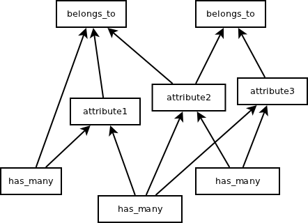
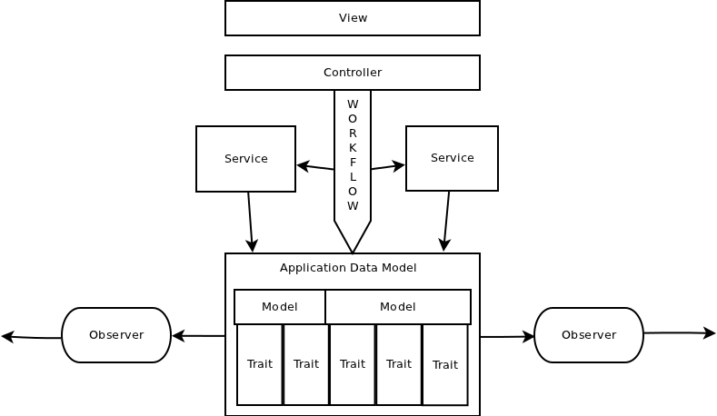

!SLIDE 
# Fighting with fat models
##### and many other problems
## Bogdan Gusiev
### September 2011

!SLIDE 

## Bogdan G.

* is 7 years in IT, 3 years with Ruby and Rails
* Contributed to:
  * Rails 
    * wait for my features in 3.2
    * Deeply understands Rails internals
    * In context of Rails moving direction
  * Resque and about 5-7 plugins
    * Knows something about high load
  * Many others

* Created:
  * datagrid - 180+ watchers
  * js-routes - 100+ watcher

!SLIDE 

## Scope of this presentation

*Scope*:

* Create
* Update 
* Delete

**Not the scope**:

* Select

!SLIDE 
##### Why the problem appear?

####All business logic code goes to *model by default*.

 

##### Why it should not be in controller?

#### Because **controller is hard** to test, maintain and reuse.

 

##### Why it should not be in **view**?

#### Many reasons

!SLIDE 

## Existing techniques

* Services 
  * Separated utility class
* Observers 
  * Event listeners
* Traits 
  * Modules that get included to models

The problem is to **understand** which one *fit best* for you.

!SLIDE 

## What do we expect?

* *Agile* process
* *Reusability* of the code
* Easy to *test*
* Make the data  **safe**

!SLIDE 
### The need of Services

#####When amount of utils that supports Model goes higher 

#####extract them to service is good idea.

    @@@ ruby

    # move
    User.create_from_facebook
    # to
    UserService.create_from_facebook
    # or
    FacebookService.create_user

!SLIDE 

## Services

The most common way to extract logic from model is create a service.

Service is separated utility class.

    @@@ ruby
    module CommentService
      def create(attributes)
        comment = Comment.create!(attributes)
        deliver_notification(comment)
      end
    end

#### "Я знаю откуда что берется"

!SLIDE 

#### The problem of services
### Services **don't** provide *default behavior*

!SLIDE 

## Need of Default Behavior

Object should incapsulate behavior:

* Data Validation
  * Set of rules that model should fit at programming level
    * Comment should have author
* Business rules
  * Set of rules that model should fit to exist in real world
    * Comment should deliver email notification

 

(Circles here)

!SLIDE 

#### What is a model?

###The model is an imitation of real object 
###that reflects some it's behaviors
###that we are focused on.

##### Wikipedia

!SLIDE 

## Implementation

Using builtin Rails code:

* ActiveModel::Observer
* ActiveRecord::Callbacks

Have the following benefits:

* Reduce number of conventions
* Suites to common knowledge - nothing more than Rails

!SLIDE 

##Hooks in models

We create default behavior and our data is safe.

Example: Comment can not be created without notification.

    @@@ ruby
    class Comment < AR::Base
      after_create :send_comment_notification
    end

!SLIDE 

## Observers

Model sends it's events to observer automatically and observer is calling a hook.

    @@@ ruby
    class CommentObserver < AR::Observer
      def after_create(comment)
        send_comment_notification(comment)
      end
    end

* *+* Model doesn't depend on the notification code
* **-** Some folks say: "Observers Not done well in Rails"

!SLIDE 

## API comparision

    @@@ ruby
    Comment.create
    # or
    CommentService.create

#### Reimplement other person's API 
#### has more wisdom than invent new one.

!SLIDE 

## **Edge cases**

### In all cases data created in regular way
### In one edge cases special rules applied

!SLIDE 

## Service with options

Plan A:

    @@@ ruby
    module CommentService
      def create_with_notification(attributes)
      def create(attributes)
    end

Maintenance problems:

* Hard to keep all team informed about all services in the App
* Hard to support as number of options goes higher

!SLIDE 

## Services with options

Plan B:

    @@@ ruby
    module CommentService
      def create(attributes, skip_notification = false)
    end

* Method will be a **mess** as number of options goes higher.
* Don't respect functional paradigm

!SLIDE 

## *Default behavior* and **edge cases**

The property of default behavior in this example:

* Hey model, create my comment.
  * Ok
* Hey model, why did you send the notification?
  * Because you didn't say you don't need it
* Hey model, create model without notification
  * Ok

!SLIDE 

## Observers with option

    @@@ ruby

    class Comment < AR::Base
      attr_accessor :skip_comment_notification
    end

    class CommentObserver < AR::Observer
      def after_create(comment)
        unless comment.skip_comment_notification
          ...
      end
    end

* Hard to access to model internals
  * Some observer code stays in model
* Have some problems with testing
* Makes the app more fragmented

!SLIDE 
### Support parameter in model

    @@@ ruby
    class Comment < AR::Base
      attr_accessor :skip_comment_notification
      def after_create
        unless self.skip_comment_notification
          send_comment_notification
        end
      end
    end

`#skip_comment_notification` is used only in edge cases.

!SLIDE 

### Observers are effective when

##**no direct access** to *observed class*

#### Example: when it is part of some library inside 
#### a fat enterprise project

!SLIDE 

###Model stands for *should*

###Service stands for *could*

###Observer stands for **big fat enterprise**

!SLIDE 
## The model is still **fat**. 
## What to do?

!SLIDE 

## Use traits

    @@@ ruby
    class Comment < AR::Base
      include Traits::Comment::Notification
    end

`Notification` module encapsulates a feature

!SLIDE 
## Traits is *Vertical slicing* 
#### Unlike MVC which is horizontal slicing.

!SLIDE 

### Vertical slicing

Split model into *Traits*

    @@@ ruby
    class User < AR::Base
      include Traits::User::Facebook
      include Traits::User::Linkedin
      include Traits::State::CanBeDisabled
    end

    module Facebook
      has_one :facebook_profile
      def connected_to_facebook?
      ...
    end

    module CanBeDisabled
      scope :disabled
      scope :enabled
      def disable!
      def disabled?
    end

!SLIDE 

### Basic application architecture

<table>
<tr>
  <td colspan="3">View</td>
</tr>
<tr>
  <td colspan="3">Controller</td>
</tr>
<tr>
  <td colspan="3" style="padding-top: 0px; padding-bottom: 0px">Thin model</td>
</tr>

<tr>
  <td style="padding-top: 40px; padding-bottom: 40px">Trait</td>
  <td>Trait</td>
  <td>Trait</td>
</tr>

</table>

!SLIDE 

## This is OOP

Traits include all staff that can be defined in model

* Scopes
* Associations
* Validation
* Callbacks

!SLIDE

### How to do it?

Lets split Model code into groups by:

* associations
* attributes

#### Dependency tree

<!--<table>-->
<!--<tr>-->
<!--<td colspan="4">Model</td>-->
<!--</tr>-->
<!--<tr>-->
<!--<td colspan="2">belongs_to :model1</td> -->
<!--<td colspan="2">belongs_to :model2</td>-->
<!--</tr>-->
<!--<tr>-->
<!--<td>attribute1</td>-->
<!--<td>attribute2</td>-->
<!--<td>attribute3</td>-->
<!--<td>attribute4</td>-->
<!--</tr>-->
<!--<tr>-->
<!--<td colspan="2">has_many :models3</td>-->
<!--<td colspan="2">has_many :models4</td>-->
<!--</tr>-->

<!--</table>-->

!SLIDE 

## Associations and Traits

Associations is a base for Traits technique.

* *`belongs_to`* is a *core* of a model 
  * This associations is used in almost all methods.
* *`has_many`* is usually *better* to create a slice
  * Methods with this associations is usually independent from each other.

!SLIDE 

#### How to not get lost?

## If *A* depends on *B* 
## then **B** should not depend on **A**

!SLIDE 

## Traits best practices

* Apply pattern to *multifunctional models* only
  * `User`
* Traits name space with the same name as model
  * `Traits::User::Facebook`

* Use *OOP*:
  * Abstract method
  * `super` is super

* Api *consistency*
  * "name", "subject", "title" => select one
  * "disabled", "inactive", "deleted" => select one

  

!SLIDE 

## Libraries using traits

* ActiveRecord
* Authlogic
* Devise
* Datagrid

##### If it is *possible* for such a **complicated library** 
##### then it is **easy** for *regular projects*

!SLIDE invisible

### Enterprise world

*Agile* projects are *well focused*

**Enterprise** apps use to **do everything**.

That is why:

* More huge web forms
* More complicated data structure 
* More significant updates

!SLIDE 

## *Flow* nature and *Event* nature

Service has flow nature:

* goes step by step
  * order can matter
* call each other
  * dependent

Observers and Callbacks have event nature:

* one can spawn more than one other events
  * can be parallelized 
* don't call each other
  * can be backgrounded
  

!SLIDE 

## Super advanced logic infrastructure

!SLIDE 

### There is only one 100% reason 
### when this can be broken.

!SLIDE 

### Of course this is 
## Perfomance
#### Others are doubtful

!SLIDE 

# Summary

!SLIDE 
### *Could?*  => **Service**
### *Should?* => **Model**
!SLIDE 
## **Fat** models => *Thin* Traits 
#### and sometimes observers
!SLIDE 
### *Reimplement* other person's API 
### has more wisdom than **invent new** one.
!SLIDE 
### If *A* depends on *B* 
### then **B** should not depend on **A**

!SLIDE 

### The **End**

#### Thanks for *watching*

##### [http://gusiev.com](http://gusiev.com)
##### [https://github.com/bogdan](https://github.com/bogdan)
