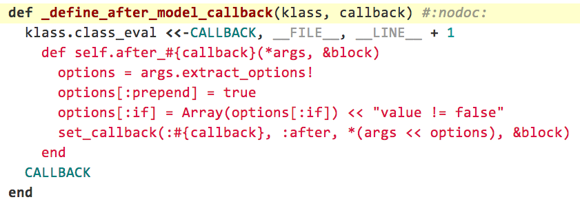
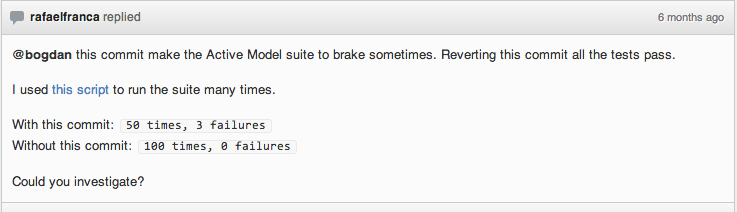

!SLIDE 
# Contribute to Rails 

## in a right way

!SLIDE 

* Motivate to start looking at the source code more often
* Give a vision on rails internal problems
  * Solved 
  * Unsolved

!SLIDE 

## The first thing to spot is that 

# documentation isn't 
# good enough

### If you start looking at the source code 
### more than at the documentation than you are on a right track.

!SLIDE

## Looking at source code 

# reveal hidden features

    @@@ ruby
    def add_default_name_and_id(options)
      ...
      options["name"] += "[]" 
        if options["multiple"]
      ...
    end

Use case:

    @@@ ruby
    roles.each do |role|
      f.check_box :role_ids, 
        :value => role.id, :multiple => true
    end

!SLIDE 

## Looking at source code 

# reveal a hidden bugs

    @@@ html
    <input type="checkbox" 
        name="user[role_ids][]" 
        value="1" multiple="multiple">

!SLIDE 

## Looking at source code 

# reveals all internal problems

[Source link](https://github.com/rails/rails/blob/master/activemodel/lib/active_model/callbacks.rb#L138)

!SLIDE 

#   bundle open activerecord

!SLIDE 

## Start with 

# fixing bugs in documentation 

# is wrong way

* You don't improve yourself
* You can do same tasks at work and get paid

!SLIDE 

## Contribute to opensource is

# do something that 

* Makes your life easier
* Lets you improve yourself

!SLIDE 

# A few examples of 
# what can make life easier

!SLIDE 

# Pluck method

    @@@ ruby
    User.where(:active => true).pluck(:id)
    # SELECT id FROM users WHERE active = 1

    User.uniq.pluck(:role)
    # SELECT DISTINCT role FROM users

!SLIDE 

## Mass assignment security that is easy to spot

    > Education.new(:user_id => 1)

    ActiveModel::MassAssignmentSecurity::Error: 
      Can't mass-assign protected 
        attributes: user_id
    from active_model/mass_assignment_security
      /sanitizer.rb:48:in 
        `process_removed_attributes'

!SLIDE 

# Strict validation

Do not let user see validation errors that he can not correct

    @@@ ruby
    class Article < AR::Base
      validates! :author, :presence => true
    end

    u = User.new
    u.save
       # raises ActiveModel::StrictValidationFailed

!SLIDE 

## How to improve yourself?

## Solve a problem that you 

# do not solve in daily work

!SLIDE 

## Rails is full of things that are not ok

## And this is where we can improve ourselves

!SLIDE 

# A histrory of Rails callback

### <strike>Rails gay callback party</strike>

!SLIDE 

# How callback pattern appeared?

    validates_presence_of :author
    validates_size_of :title
    validates_uniqueness_of :slug

    before_filter :load_user
    before_filter :require_admin_rights
    after_filter :set_page_title

    before_save :downcase_email_address
    after_save :deliver_registration_email
    before_save :generate_api_token

!SLIDE 

## A feeling like 
# something is add to array

    @@@ ruby
    def self.validate(&validator)
       self.validators << validator
    end

    def valid?
      validators.all? do |validator|
        validator.call(self)
      end
    end

!SLIDE 

# How this gonna work with objects hierarchy?

    @@@ ruby
    class User < AR::Base
      validates_size_of :name
    end

    class Customer < User
      validates_presence_of :company
    end

    class TeamMember < User
      validates_presence_of :role
    end

!SLIDE 

# Is it fast?

* Interations over array when #valid? is called
* Memory usage to store these arrays
* Pass though inherited objects on update

!SLIDE 

## A feeling like when callbacks were invented
# Rails core team 
# was not aware of OOP 

    @@@ ruby
    def valid?
      validates_presence_of(:aution) && 
        validates_size_of(:title) &&
        validates_uniqueness_of(:slug) && 
        super
    end

!SLIDE 

# Anyway active\_support/callbacks.rb was invented

## and it was huge step ahead 
## comparing to different implementation 
## accross Rails libraries

!SLIDE 

# Performance problem was solved

    class CallbackChain < Array
    def compile
      method = []
      method << "value = nil"
      method << "halted = false"
      callbacks = "value = !halted && (!block_given? || yield)"
      reverse_each do |callback|
        callbacks = callback.apply(callbacks)
      end
      method << callbacks
      method << "value"
      method.join("\n")
    end
    end

!SLIDE 

# But Rails Boot time was a cost
## Each time new callback is added

    @@@ ruby
    validates_presence_of :user

## Rails redefines callback method
    
    def set_callback(*args)
      add_callback_to_chain(*args)
      recompile_callback_method
      and_dont_forget_about_inherited_classes
    end

!SLIDE 

## What did I do?
# Get rid of other optimization in Callbacks

## It was clean that other optimization 
## made in callbacks doesn't work

!SLIDE 

<pre>
1   +
3   ++-
2   +-
4   ++--
19  +++----------------
14  +++++++-------
27  +--------------------------
30  ++++++++++++---------------
47  ++++++++-------------------
7   ++++++-
4   ++--
42  +++++----------------------
19  +++----------------
19  +++----------------
14  ++++++++------
5   ++---
21  +++++++++++----------
120 +++++++++++++-------------
26  ++++++++++++--------------
16  ++++++----------
45  +++++++++++++--------------
</pre>

!SLIDE 

# Callbacks optimization method 
# could be generated lazily

    @@@ ruby
    def run_callbacks(name)
      runner_method = __callback_runner_name(name)
      unless respond_to?(name)
        define_callback_runner(name)
      end
      send(name)
    end

!SLIDE 

## The only one thing left
# Construct a runner method is slow

    @@@ ruby
    def __callback_runner_name(kind)
      class_id = name.hash.abs
      "_run__#{class_id}__#{kind}__callbacks"
    end

!SLIDE 

## Last try resulted in this comment

<!--@bogdan this commit make the Active Model suite to brake sometimes. Reverting this commit all the tests pass.-->

<!--I used [this script](https://gist.github.com/f6828a03ee4d40bffbc3) to run the suite many times.-->

<!--With this commit: `50 times, 3 failures`-->

<!--Without this commit: `100 times, 0 failures`-->

[Link](https://github.com/rails/rails/pull/6351#commitcomment-1404989)

!SLIDE 

# A histroy of Rails Router

!SLIDE 

# Rails 1.x

    /:controller/:action(/:id)

## Allows to move through abstraction layer

!SLIDE 

# Rails 1.x

    url_for(
      :controller => :users, 
      :action => :show,
      :id => 1
    )

!SLIDE 

# Rails 2.x

    /:controller/(:id/):action

## Rest compatible

!SLIDE 

# Rails 2.x

## Named Routes

    user_path(1)

* Each route has an internal *unique name*
* Find a route by name is really faster

!SLIDE 

# Rails 3.x

    (/locale/:locale)/page/:name 
                  => "pages#show"

* Additional flexibility
* Journey as a router backend

* Makes REST less strict
  * because nobody care at the end but it is ok

!SLIDE 

# Journey solved route recognition problem

Journey parses each route and converts it into 

Abstract Syntax Tree

!SLIDE 

# The result of 
# router evolution

!SLIDE 

## It's new library, so

# Journey is not optimized yet

    @@@ ruby

    routes.map! { |r|
      match_data  = r.path.match(req.path_info)
      match_names = match_data.names.map do |n| 
        n.to_sym 
      end
      match_values = match_data.captures.map do |v| 
        v && Utils.unescape_uri(v) 
      end
      info = Hash[match_names.zip(match_values).
        find_all { |_,y| y }]

      [match_data, r.defaults.merge(info), r]
    }

!SLIDE 

# Bloody mess internals
## as the outcome

    @@@ ruby
    if options.has_key?(:action) 
        && options[:action].nil?
      options[:action] = 'index'
    end
    if options[:action] == 'index' 
      recall[:action] = options.delete(:action) 
    end

[Source code](https://github.com/rails/rails/blob/master/actionpack/lib/action_dispatch/routing/route_set.rb#L522)

!SLIDE 

# A need to support unnamed routes with recall

    @@@ ruby
    # Pseudocode
    def url_for(options)
      options = options.reverse_merge(recall)
      route = routes.find do |route|
        route.match?(options)
      end
      route = format_route(route, options)
    end

!SLIDE 

# ActionPack is a worth
# rails component now

!SLIDE 

# Why json kills the performance?

            user     system   total     real
    user_path(1)                   
            0.1500   0.0000   0.1500 (  0.150241)
    users_path(1, format: :json)   
            1.0700   0.0100   1.0800 (  1.079205)

(link generated 1000 times)

!SLIDE 

## Links generation is extremely slow

It takes one millisecond to create a link like this:

    @@@ ruby
          user_path(user, :format => "json")

A page with **100 links** will be generated in **100ms**

!SLIDE 

# http://github.com

    @@@ javascript
    jQuery("a").length // => 177

!SLIDE 

<pre>
@module.module_eval <<-END_EVAL, __FILE__, __LINE__ + 1
  remove_possible_method :#{name}
  def #{name}(*args)
    if #<strong>{optimize_helper?</strong>(route)} && args.size == #{route.required_parts.size} && !args.last.is_a?(Hash) && <strong>optimize</strong>_routes_generation?
      <strong># this is fast</strong>
      options = #{options.inspect}
      options.merge!(url_options) if respond_to?(:url_options)
      options[:path] = "#{<strong>optimized_helper</strong>(route)}"
      ActionDispatch::Http::URL.url_for(options)
    else
      <strong># this is slow</strong>
      url_for(handle_positional_args(args, #{options.inspect}, #{route.segment_keys.inspect}))
    end
  end
END_EVAL
</pre>

!SLIDE 

> "I, based on my work with various teams,
> **consider Rails** a nice set of conventions,
> a **fantastic routing system** and a very useful ORM."

Someone comment in github.com/rails/rails

!SLIDE 

## Why all those things are optimized?

## I want things to be always optimized

(c) Aaron Peterson

!SLIDE 

# This problem is not solved

## Aaron Peterson is too busy to solve it for you

## And I can not solve it on my own

# I need your help

